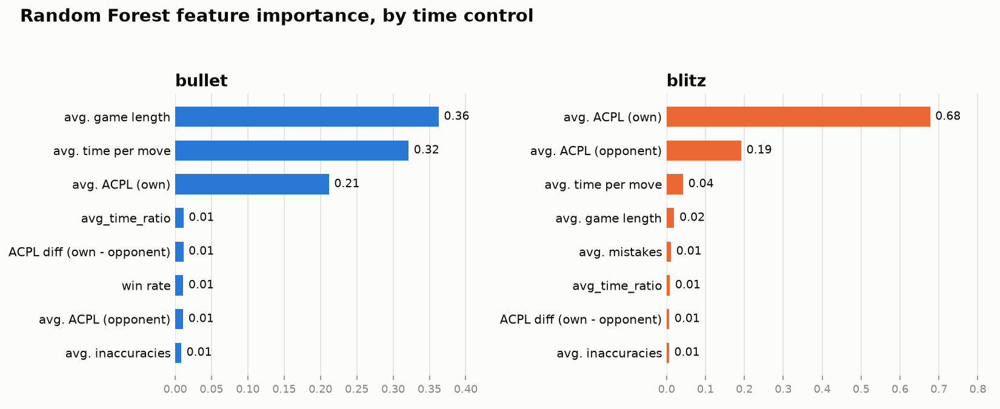

# Chess Rating Predictor

Machine learning project that predicts a player's **Lichess** rating (their
Glicko-2 Elo on lichess.org, specifically -- not a FIDE/USCF rating or a
generic "chess skill" score, and not transferable to those) from a
handful of their own games in PGN format, either fetched live from the
Lichess API or uploaded as a PGN file.

The core idea: the outcome of a single game is noisy (a bad day, an odd
opponent), but averaging move-quality features over 5-15 games of the
same player gives a much more stable signal to predict their rating from.

## Results

Trained on real Lichess data (August 2026 dump), one dedicated model per
time control, evaluated on a held-out 20% of players:

| Time control | Players | Model | MAE (Elo points) | R² |
|---|---|---|---|---|
| Bullet | 3,258 | Ridge | 279 | 0.808 |
| Bullet | 3,258 | Random Forest | 199 | 0.883 |
| Bullet | 3,258 | **Gradient Boosting (deployed)** | **192** | **0.889** |
| Blitz | 3,437 | Ridge | 214 | 0.872 |
| Blitz | 3,437 | Random Forest | 168 | 0.917 |
| Blitz | 3,437 | **Gradient Boosting (deployed)** | **164** | **0.918** |

For context: always predicting the dataset mean gets a MAE of roughly
650-700 points, so the model is explaining the large majority of the
variance in players' ratings from move-quality features alone -- without
ever being told the player's Elo history.

The single most useful thing that got these numbers this high wasn't a
better model -- it was **sampling training players evenly across the
whole Elo range** (see "Design notes" below) instead of however a scan of
the dump happens to encounter them. Before that fix, R² on the same
features and models was 0.28-0.62.

Most influential features (bullet):
`avg_num_plies` and `avg_time_per_move` dominate -- under bullet's time
pressure, *how* someone manages the clock and how long their games last
says more about their level than raw move accuracy.

Most influential features (blitz):
`avg_acpl` (Stockfish's move-quality score) dominates on its own (0.63)
-- with more time to think, actual move quality is what gives skill away.



*(Random Forest importances shown for both, since HistGradientBoostingRegressor
-- the winning model for bullet -- doesn't expose them at all; regenerate
with `python src/plot_feature_importance.py`.)*

## Try it: the Streamlit demo

```bash
streamlit run app.py
```

Opens a local web app where you type a Lichess username (or upload/paste
a PGN) and get back a predicted rating for bullet or blitz, computed from
their own recent games -- run through the exact same Stockfish analysis
and feature pipeline the models were trained on. Needs at least 5 games
in the chosen time control, and a trained model in `models/` (see
"Full pipeline" below to build one, or train against the sample data).

## Project structure

```
chess-rating-predictor/
├── app.py                        # Streamlit demo (predicts from a Lichess username or an uploaded PGN)
├── data/
│   ├── raw/                      # original PGNs (not committed, except the small samples)
│   └── processed/                # CSVs/PGNs generated by the scripts
├── docs/                         # charts referenced from this README
├── models/                       # trained models (not committed -- regenerate with train_baseline.py)
├── src/
│   ├── parse_pgn.py              # MVP: PGN -> per-game CSV with basic features, no engine
│   ├── extract_sample.py         # cuts the first N games out of a huge Lichess .pgn.zst
│   ├── select_games_by_player.py # scans a full Lichess dump, selects games per player per time control
│   ├── analyze_with_stockfish.py # runs Stockfish (in parallel, resumable) for move-quality features
│   ├── extract_clock_features.py # derives time-per-move from the PGN's clock comments
│   ├── aggregate_by_player.py    # averages per-game features into one row per player
│   ├── train_baseline.py         # trains and compares models (Ridge / Random Forest / Gradient Boosting)
│   ├── predict_from_pgn.py       # shared feature extraction for live predictions (used by app.py)
│   ├── lichess_api.py            # fetches a player's games from the public Lichess API
│   ├── plot_feature_importance.py # renders the chart in the Results section above
│   └── benchmark_stockfish.py    # measures analysis speed at a given depth before committing to a run
├── requirements.txt
└── README.md
```

## Setup

1. Create a virtual environment:
   ```bash
   python -m venv .venv
   source .venv/bin/activate      # on Windows: .venv\Scripts\activate
   ```
2. Install the dependencies:
   ```bash
   pip install -r requirements.txt
   ```
3. Download [Stockfish](https://stockfishchess.org/download/) and place the
   executable somewhere the scripts can find it (see `STOCKFISH_PATH` in
   `analyze_with_stockfish.py` / `benchmark_stockfish.py`).

## Quick check with the sample PGN

The repo includes `data/raw/sample.pgn` (3 sample games) and
`data/raw/lichess_sample.pgn` (20,000 real games) so you can verify the
basic pipeline works without downloading anything:

```bash
python src/parse_pgn.py --input data/raw/sample.pgn --output data/processed/sample_games.csv
```

This should generate `data/processed/sample_games.csv` with one row per
game (White/Black rating, opening, number of plies, result).

## Full pipeline with real Lichess data

1. **Download a Lichess dump.** Go to
   [database.lichess.org](https://database.lichess.org/) and grab one of
   the monthly files (`.pgn.zst`, tens of GB compressed). Every script
   here streams the decompression on the fly -- none of them ever write
   the fully decompressed file to disk, so you only need free space for
   the compressed download itself.

2. **Select a manageable, player-grouped subset -- one dedicated dataset
   per time control:**
   ```bash
   python src/select_games_by_player.py
   ```
   Edit the constants at the top of the script (`ZST_PATH`,
   `TARGET_SPEED_CATEGORIES`, `MIN_GAMES_PER_PLAYER`,
   `MAX_GAMES_PER_PLAYER`, `TARGET_PLAYERS_PER_CATEGORY`,
   `ELO_BUCKET_WIDTH`) to match your setup. Writes one PGN per category,
   e.g. `data/processed/selected_games_bullet.pgn`. Meant to be left
   running unattended: two full passes over the dump (a few hours each on
   a monthly file), progress logged to `logs/` in UTF-8, and if
   interrupted it still saves whatever was already selected.

3. **Extract move-quality features with Stockfish** (repeat per category):
   ```bash
   python src/analyze_with_stockfish.py \
       --input data/processed/selected_games_bullet.pgn \
       --output data/processed/games_engine_bullet.csv \
       --max-games 60000 --depth 12
   ```
   Runs several Stockfish processes in parallel (`--workers`, defaults to
   roughly half the machine's logical CPU count, since Stockfish gets
   little benefit from hyperthreading) and is the slowest step by far --
   use `benchmark_stockfish.py --depth N` first to check how a given
   depth trades off against speed before committing to a full run.
   Checkpoints to `--output` every 200 games and, if that file already
   exists when you (re-)run it, resumes from it instead of redoing
   already-analyzed games -- safe to re-run after any interruption,
   including a crash.

4. **Extract time-per-move from clock comments** (optional but recommended;
   repeat per category):
   ```bash
   python src/extract_clock_features.py \
       --input data/processed/selected_games_bullet.pgn \
       --output data/processed/games_clock_bullet.csv
   ```

5. **Aggregate by player** (repeat per category):
   ```bash
   python src/aggregate_by_player.py \
       --input data/processed/games_engine_bullet.csv \
       --clock-input data/processed/games_clock_bullet.csv \
       --output data/processed/players_bullet.csv
   ```
   Collapses the per-game CSV into one row per player, averaging their
   features over their games (restricted to whichever time control they
   actually played, in case games from another format snuck in).

6. **Train and save a model** (repeat per category):
   ```bash
   python src/train_baseline.py \
       --data data/processed/players_bullet.csv \
       --speed-category bullet \
       --save-model-dir models
   ```
   Trains Ridge, Random Forest and Gradient Boosting, reports MAE/R² for
   each, and saves the best one to `models/model_bullet.joblib` for
   `app.py` to load.

## Design notes

A few non-obvious decisions, in case the reasoning matters more than the
code:

- **Sample players evenly across the Elo range, not however they show up.**
  Early versions just took whichever eligible players appeared first while
  scanning the dump -- since a small number of very active players near
  the median contribute a disproportionate share of raw games, this
  produced a training set concentrated around the median with almost no
  players at the tails. A model trained on that skew is unreliable for
  anyone far from the middle (a 3200-rated player looks nothing like
  anyone it's seen). `select_games_by_player.py` now buckets eligible
  players into `ELO_BUCKET_WIDTH`-point bands and samples a roughly even
  number from EACH band (capped by how many actually exist in a sparse
  band). This one change took R² from 0.28-0.62 to 0.89-0.92.

- **Never mix time controls for the same player.** Lichess gives every
  player a separate rating per speed (someone can be 2400 in bullet and
  2000 in rapid). A dataset that mixes a player's bullet and blitz games
  would average together ratings -- and Stockfish features, since bullet
  games are short and sloppy almost regardless of skill -- that don't mean
  the same thing. `select_games_by_player.py` builds a fully separate,
  dedicated player pool per time control from the start.

- **Exclude the opponent's Elo, but keep the opponent's move quality.**
  Lichess's matchmaking pairs similarly-rated players, so a player's own
  Elo and their average opponent's Elo turn out correlated at ~0.97 in
  this data -- including it lets a model predict Elo almost entirely via
  the opponent's Elo, trivially inflating R² without learning anything
  from actual play. The opponent's ACPL/blunders don't have that problem
  (matchmaking doesn't pair by how cleanly someone happens to play in one
  game) and are kept: a sloppy game from the opponent is a sign the
  position itself was messy, which puts the player's own ACPL in that
  game into context.

- **Predict from several games, not one.** The whole "5-15 games,
  averaged" design exists because a single game's outcome is dominated by
  noise (an opponent's blunder, a bad day). Averaging Stockfish-derived
  features over several games of the same player is much more stable, and
  is what actually makes prediction from move quality feasible at all.

- **Normalize time-per-move by that game's own clock, but don't rely on it
  alone.** "Bullet" spans several actual time controls with very different
  clocks (60+0 is ~82% of this dataset, but 120+1 -- with roughly double
  the budget -- makes up most of the rest). A raw seconds-per-move average
  isn't comparable across them: a player who exclusively plays 120+1 got
  mispredicted by 500+ Elo points because their time usage looked nothing
  like the 60+0 majority the model mostly learned from. `avg_time_ratio`
  (time spent as a fraction of that specific game's budget) fixes the
  comparability problem -- but a direct test of *replacing*
  `avg_time_per_move` with it made the model meaningfully worse overall
  (bullet R² 0.889 -> 0.847), so it's kept as an additional feature rather
  than a replacement. That means minority-time-control players like the
  one above aren't fully fixed -- the model still leans on the raw,
  confounded feature where it's more informative for the majority. A
  cleaner fix would need a per-time-control model or an explicit
  interaction term, not just another averaged feature.

## Next steps

- [ ] Phase-specific move quality (opening/middlegame/endgame ACPL)
      instead of one number per game.
- [ ] A dedicated rapid dataset -- currently too small a slice of Lichess
      traffic to train (and evaluate) reliably.
- [ ] Cross-validation instead of a single train/test split, for a more
      robust MAE/R² estimate.
